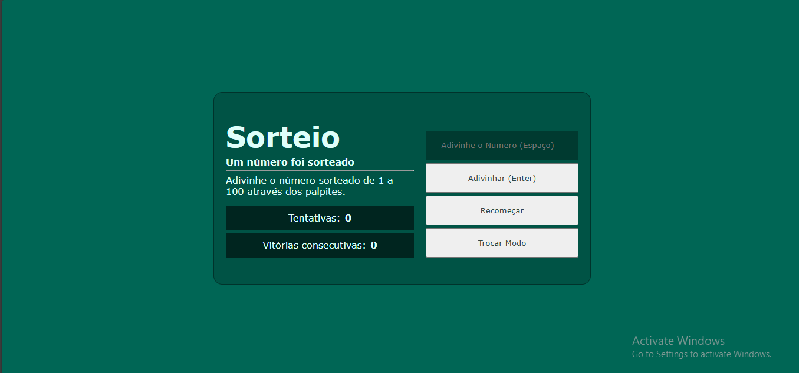

# 🎲 Jogo de Número Aleatório

Um projeto simples e educativo desenvolvido em **HTML**, **CSS** e **JavaScript**, com foco em lógica, interação e boas práticas de código.

## 🧠 Sobre o Jogo

O objetivo é adivinhar o número sorteado entre **1 e 100**.  
Existem **dois modos de jogo**:

- 🎯 **Modo Ilimitado:** tente quantas vezes quiser!  
- ⏱️ **Modo Desafio:** você tem **7 tentativas** para acertar.

Além disso:
- As teclas **Enter** e **Espaço** podem ser usadas como atalhos para interagir com os botões.
- O jogo é totalmente **responsivo**, adaptando-se a diferentes tamanhos de tela.
- O **CSS foi minificado** para melhor desempenho.
- Código organizado seguindo **boas práticas de estrutura e legibilidade**.

---

## 🚀 Tecnologias Utilizadas

- HTML5  
- CSS3 *(minificado)*  
- JavaScript (DOM e lógica de jogo)  

---

## 🧩 Funcionalidades

- Sorteio aleatório de número entre 1 e 100  
- Contagem de tentativas e vitórias consecutivas  
- Alternância entre modos de jogo  
- Reinício rápido com o botão **Recomeçar**  
- Suporte a **teclas de atalho (Enter e Espaço)**  

---

## 📱 Demonstração

🔗 **Acesse o jogo:**  
👉 [https://kaue1881.github.io/Jogo-Numero-Aleatorio/](https://kaue1881.github.io/Jogo-Numero-Aleatorio/)

---

## 💡 Objetivo Educacional

Este projeto foi criado para reforçar conceitos de:
- Lógica de programação  
- Manipulação do DOM  
- Estrutura e responsividade de interfaces  
- Boas práticas de escrita de código  

Ideal para quem está **começando no front-end** e quer praticar de forma divertida!
